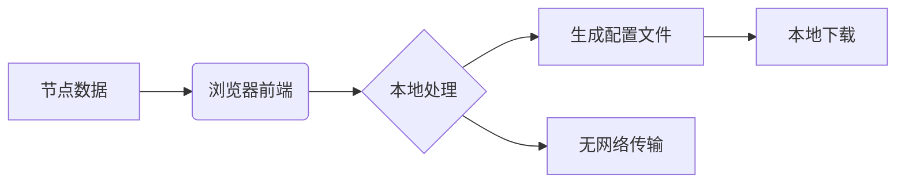

> 告别端口冲突！3 步将 SS/Vmess/Vless 等任意节点转化为独立 Socks5 通道，解决指纹浏览器多账号IP隔离难题

作为跨境电商运营者，你是否面临这样的困境：
- 指纹浏览器中每个账号环境需要独立 IP
- 机场订阅或自建节点却是 SS/Vmess/Vless 等协议
- 代理工具**只认 Socks5 端口**且**仅支持单端口出口**

本文将彻底解决这个问题！通过开源工具实现：

✅ **任意协议节点** → 本地 Socks5 代理  
✅ **单端口对应单节点**（多入口多出口）  
✅ 全程**前端本地操作**，节点信息零泄露

[【YouTube 视频讲解】](https://youtu.be/ZXanc7wpP9g)


## 所需工具准备

1. **协议转换工具**：[Socks5 生成器](https://sp.hotrue.cc/)（纯前端）
2. **代理客户端**：[v2rayN](https://github.com/2dust/v2rayN)（下载ZZ开头压缩包）
3. **进阶需求**：[本地订阅转换工具](https://github.com/tindy2013/subconverter)（合并多机场）

>[!NOTE] 所有工具链接已整理在文末GitHub仓库

---
### 第一步：获取
#### 方式 1：获取Clash格式节点配置
**机场用户**：  
直接拖拽Clash订阅文件到工具输入框

**自建节点用户**：
请直接看 [[一键实现多协议转Socks5代理：跨境电商多账号独立IP终极方案#进阶技巧：复杂场景处理 | 进阶技巧]]

#### 方式 2：直接打开配置文件并复制 proxies 关键字段
```yaml
# 在生成配置文件中的 proxies 关键字段
proxies:
  - {name: "🇸🇬 新加坡", server: sg.example.com, port: 443, type: vmess...}
  - {name: "🇺🇸 美国", server: us.example.com...} 
```

**操作提示**：
1. 设置起始端口（默认 42000），数量会自动根据配置计算
2. 勾选`设置默认端口`保留 10808（可选，将端口 10808 保留给首个节点）
3. 点击【生成配置】→ 下载YAML文件

### 第二步：导入v2rayN生效
1. 客户端 → 服务器 → 添加自定义配置服务器
2. 导入下载的 YAML 文件
3. **关键设置**：
   - 内核类型：`clash.meta` 或 `mihomo`
   - SOCKS 端口：**留空**（填 0 会导致首节点失效）
4. 右键配置 → 设为活动服务器


## 效果验证：指纹浏览器多IP实战
---

| 浏览器环境 | 代理端口  | 实际出口IP |
| ----- | ----- | ------ |
| 店铺A   | 42000 | 越南 IP  |
| 店铺B   | 42005 | 德国 IP  |
| 店铺C   | 42012 | 日本 IP  |

> [!NOTE] 端口号按 Clash 配置中节点顺序排列，42000对应首个节点

## 进阶技巧：复杂场景的协议转换处理
---

#### 场景1：合并多个机场订阅

1. 运行本地订阅转换服务（软件安装见附件）
2. 复制并粘贴所有订阅链接的路径地址（每行一个）
3. 获取合并后的Clash订阅URL
4. 回到步骤1转换

#### 场景2：混合本地节点+机场


```markdown
1. 在v2rayN中选中需要导出的节点右键 → [导出配置文件] → [导出分享链接至剪贴板（多选）]
2. 粘贴所有链接到 [订阅链接转换工具]
3. 点击【生成配置】
```

1. 在工具输入框同时粘贴：
   - 机场 Clash 配置文件内容
   - v2rayN 导出的 `vmess://链接` 或 `vless://链接` 或其他所有链接等
2. 记得运行 `本地订阅转换工具` 软件（链接见附件或者上面工具链接） 
3. 点击生成 → 自动合并所有节点
4. 之后回到上面按照【核心操作】的说明操作

## 安全性声明
---

- **零数据上传**：所有转换在浏览器中完成
- **源码可审计**：[工具GitHub仓库](https://github.com/your-repo)
- 推荐本地部署：`git clone`后直接打开index.html使用

## 常见问题解答
---

**Q：Socks 节点生成时出现处理失败的错误？**  
A：请确认 `Clash配置文件内容` 包含有 `proxies:` 字段及内容。

**Q：导入v2rayN报错？**  
A：检查：
1. YAML 文件缩进必须使用空格（非Tab）
2. 内核选择 clash.meta 或 mihomo
3. 删除配置文件中的`rules`规则集

**Q：Windows中文路径问题？**  
A：订阅转换工具需放在**全英文路径**下运行

## 📦 本文用到的所有工具
---

1. [Socks5端口生成器](https://sp.hotrue.cc)
2. [v2rayN 6.0+](https://github.com/2dust/v2rayN/releases)
3. [本地订阅转换工具](https://github.com/tindy2013/subconverter)

---

通过这个方案，我们成功将**协议兼容性问题**转化为**灵活的端口管理问题**。无论是机场订阅还是自建节点，都能为每个指纹浏览器环境分配专属出口IP，且全程操作不超过3分钟。

